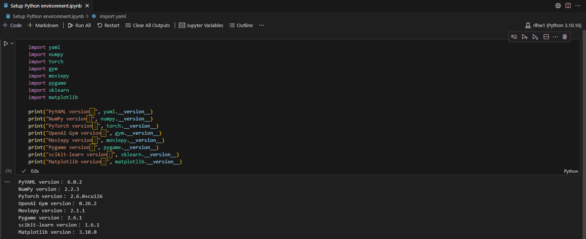

# Homework: Setup Python environment  
## **Step 1: Create a new Conda environment** 
```bash
conda create -n rlhw1 python=3.10 -y
```
## **Step 2: Activate the environment** 
```bash
conda activate rlhw1
```
## **Step 3: Install dependencies** 
```bash
pip install -r requirements.txt
```
```bash
pip3 install torch torchvision torchaudio --index-url https://download.pytorch.org/whl/cu126
```
## **Step 4: Verify Installed Packages (run "Setup Python environment.ipynb")** 

